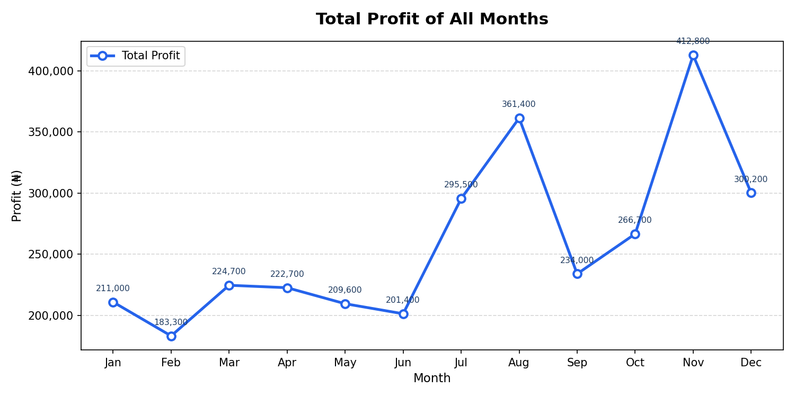
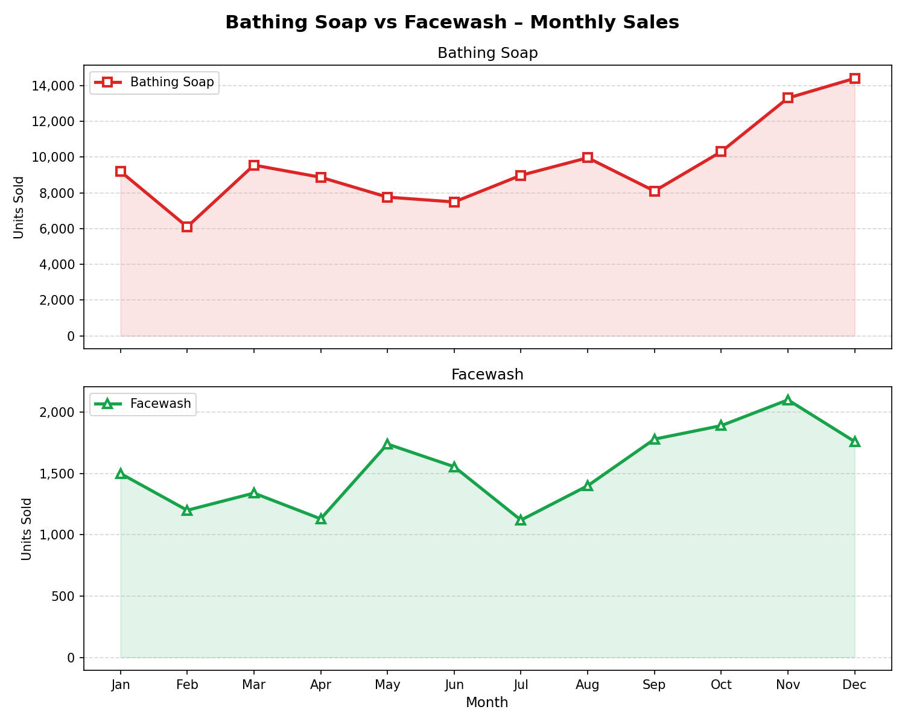

# Module 1 — Introduction to Python Programming for Data Science

> **Level:** Beginner &nbsp;·&nbsp; **Week:** 1 & 2 &nbsp;·&nbsp; **Status:** ✅ Complete

This document walks through everything built for Module 1 — the thinking behind each program, how the code works, and what the output looks like.

---

## 📁 Files in This Folder

| File | Task | Description |
|------|------|-------------|
| `rock_paper_scissors.py` | Task 1 | RPS game — user vs computer |
| `tictactoe_ai.py` | Task 2 | Tic-Tac-Toe with Minimax AI agent |
| `matplotlib_exercises.py` | Task 2 | Two Matplotlib chart exercises |
| `exercise1_total_profit.png` | Task 2 | Line plot output — total profit |
| `exercise2_subplot.png` | Task 2 | Subplot output — soap vs facewash |

---

## Task 1 — Rock, Paper, Scissors

### What the program does
A terminal game where the user plays Rock, Paper, Scissors against the computer. The computer picks randomly, and the program decides who wins based on the classic rules. It keeps score across as many rounds as you want to play.

### How I built it

**Step 1 — Define the possible choices**

Instead of using if-statements to hardcode the rules, I used a dictionary called `WINS_AGAINST` that maps each choice to whatever it beats. This keeps the logic clean and easy to read.

```python
CHOICES = ["rock", "paper", "scissors"]

WINS_AGAINST = {
    "rock":     "scissors",
    "paper":    "rock",
    "scissors": "paper",
}
```

**Step 2 — Get the user's choice**

The `get_user_choice()` function loops until the user types something valid. If they mistype, they get a clear error message and are asked again — no crash, no silent failure.

```python
def get_user_choice():
    while True:
        choice = input("Your choice: ").strip().lower()
        if choice in CHOICES:
            return choice
        print(f"  ✗ '{choice}' is not valid. Please enter rock, paper, or scissors.")
```

**Step 3 — Generate the computer's choice**

`random.choice()` picks from the `CHOICES` list with equal probability — completely fair.

```python
def get_computer_choice():
    return random.choice(CHOICES)
```

**Step 4 — Determine the winner**

`determine_winner()` checks three cases: draw (same choice), win (user's pick beats the computer's), or lose. It uses the `WINS_AGAINST` dictionary from Step 1 — no long if/elif chains needed.

```python
def determine_winner(user, computer):
    if user == computer:
        return "draw"
    elif WINS_AGAINST[user] == computer:
        return "win"
    else:
        return "lose"
```

**Score tracking across rounds**

The `main()` function holds a score dictionary and loops, calling `play_game()` each round, until the user decides to stop.

### Sample output

```
========================================
       ROCK  ✊  PAPER  ✋  SCISSORS  ✌️
========================================

Choices: rock | paper | scissors
Your choice: rock
Computer chose: scissors

  You: rock  vs  Computer: scissors
🎉 You win!

Score → You: 1  |  Computer: 0  |  Draws: 0

Play again? (yes / no):
```

---

## Task 2a — Tic-Tac-Toe AI Agent

### What the program does
A terminal Tic-Tac-Toe game where the user plays as **X** and the AI plays as **O**. The AI uses the **Minimax algorithm** — it plays perfectly and cannot be beaten, only tied. The board is displayed in the terminal after every move.

### How I built it

**Step 1 — Define the game board**

The board is a flat list of 9 cells, each starting as a space. Positions 1–9 map to indices 0–8. Two helper functions handle display.

```python
def create_board():
    return [" " for _ in range(9)]
```

The board is displayed like this in the terminal:

```
  Board positions:       After moves:
  1 | 2 | 3             X | O | X
  ---------             ---------
  4 | 5 | 6               | O |  
  ---------             ---------
  7 | 8 | 9               |   |  
```

**Step 2 — Check if a player has won**

All 8 winning combinations (3 rows, 3 columns, 2 diagonals) are stored as a list. `check_winner()` loops through them and returns `True` if any combination is fully owned by the given player.

```python
WIN_COMBINATIONS = [
    [0, 1, 2], [3, 4, 5], [6, 7, 8],   # rows
    [0, 3, 6], [1, 4, 7], [2, 5, 8],   # columns
    [0, 4, 8], [2, 4, 6],              # diagonals
]

def check_winner(board, player):
    return any(
        all(board[cell] == player for cell in combo)
        for combo in WIN_COMBINATIONS
    )
```

**Step 3 — Check if the game is a tie**

A tie happens when every cell is filled and nobody has won. Simple check — if there are no spaces left, it's a draw.

```python
def check_tie(board):
    return " " not in board
```

**Step 4 — The AI: Minimax algorithm**

This is what makes the AI smart. Minimax recursively simulates every possible future game state. The AI (`O`) tries to **maximise** its score; the user (`X`) is assumed to **minimise** it. Scores: AI wins = +1, user wins = -1, draw = 0.

```python
def minimax(board, is_maximizing):
    if check_winner(board, "O"): return 1
    if check_winner(board, "X"): return -1
    if check_tie(board):         return 0

    if is_maximizing:
        best = -math.inf
        for move in get_available_moves(board):
            board[move] = "O"
            score = minimax(board, False)
            board[move] = " "
            best = max(best, score)
        return best
    else:
        best = math.inf
        for move in get_available_moves(board):
            board[move] = "X"
            score = minimax(board, True)
            board[move] = " "
            best = min(best, score)
        return best
```

`get_ai_move()` calls `minimax()` for each available position and picks whichever gives the highest score.

**Step 5 — Main game loop**

The `main()` function alternates turns between `X` (user) and `O` (AI), checks for a win or tie after every move, and handles input validation so invalid entries don't crash the game.

**Step 6 — Call the main game loop**

```python
if __name__ == "__main__":
    main()
```

### Sample output

```
========================================
       TIC-TAC-TOE  |  You vs AI
========================================
  You = X    |    AI = O

  Board positions:
  1 | 2 | 3
  ---------
  4 | 5 | 6
  ---------
  7 | 8 | 9

  Enter position (1-9): 5

  AI is thinking...
  AI played position 1

  O |   |  
  ---------
    | X |  
  ---------
    |   |  
```

---

## Task 2b — Matplotlib Exercises

### Dataset
Company sales data from [pynative.com](https://pynative.com/wp-content/uploads/2019/01/company_sales_data.csv) — 12 months of product sales figures including `total_profit`, `bathingsoap`, and `facewash`.

| month | facecream | facewash | bathingsoap | ... | total_profit |
|-------|-----------|----------|-------------|-----|--------------|
| 1 | 2500 | 1500 | 9200 | ... | 211000 |
| 2 | 2630 | 1200 | 6100 | ... | 183300 |
| ... | ... | ... | ... | ... | ... |
| 12 | 2900 | 1760 | 14400 | ... | 300200 |

The data is loaded with Pandas:

```python
import pandas as pd
import matplotlib.pyplot as plt

df = pd.read_csv("company_sales_data.csv")
```

---

### Exercise 1 — Total Profit Line Plot

**Goal:** Show how total profit changes across all 12 months using a line plot.

**Approach:**
- Used `ax.plot()` with circular markers (`"o"`) so each month is clearly visible
- Added `ax.annotate()` to label every data point with its exact value
- Formatted the y-axis with commas using `mticker.FuncFormatter` so `211000` displays as `211,000`

```python
ax1.plot(
    MONTHS, df["total_profit"],
    color="#2563EB", linewidth=2.5,
    marker="o", markersize=7,
    markerfacecolor="white", markeredgewidth=2,
)
```

**Key observation from the chart:** Profit dips in February (183,300) then steadily climbs through the year, peaking in November at 412,800 — nearly double the February low.

**Output:**



---

### Exercise 2 — Bathing Soap vs Facewash Subplot

**Goal:** Compare monthly Bathing Soap and Facewash sales side by side using subplots.

**Approach:**
- Used `plt.subplots(2, 1)` to create two vertically stacked charts sharing the same x-axis (`sharex=True`)
- Added `fill_between()` shading beneath each line to make trends easier to read at a glance
- Each product gets a distinct colour and marker shape — red squares for Bathing Soap, green triangles for Facewash

```python
fig2, (ax2, ax3) = plt.subplots(2, 1, figsize=(10, 8), sharex=True)

# Top — Bathing Soap
ax2.plot(MONTHS, df["bathingsoap"], color="#DC2626", marker="s")
ax2.fill_between(range(12), df["bathingsoap"], alpha=0.12, color="#DC2626")

# Bottom — Facewash
ax3.plot(MONTHS, df["facewash"], color="#16A34A", marker="^")
ax3.fill_between(range(12), df["facewash"], alpha=0.12, color="#16A34A")
```

**Key observation from the chart:** Bathing Soap sales are consistently much higher than Facewash (9,000–14,000 vs 1,100–2,100 units), and both products peak in November/December.

**Output:**



---

## Key Concepts Used

| Concept | Where it appears |
|---------|-----------------|
| `random` module | RPS — computer choice generation |
| Dictionaries | RPS — `WINS_AGAINST` rules map |
| `while` loops + input validation | RPS & Tic-Tac-Toe — user input handling |
| List comprehensions | Tic-Tac-Toe — `get_available_moves()` |
| Recursion | Tic-Tac-Toe — Minimax algorithm |
| `import math` | Tic-Tac-Toe — `math.inf` for Minimax scoring |
| `pandas` | Matplotlib — loading the CSV dataset |
| `matplotlib.pyplot` | Both chart exercises |
| `subplots()` | Exercise 2 — side-by-side comparison |
| f-strings | Throughout — formatted terminal output |

---

## How to Run

**Requirements:**
```bash
pip install matplotlib pandas
```

**Run the games:**
```bash
python rock_paper_scissors.py
python tictactoe_ai.py
```

**Run the charts:**
```bash
python matplotlib_exercises.py
# Saves: exercise1_total_profit.png and exercise2_subplot.png
```

---

## Submission

| Task | File | Link |
|------|------|------|
| Task 1 — Rock, Paper, Scissors | `rock_paper_scissors.py` | [View on GitHub](https://github.com/Olisebinum/Gen-AI-Pathway/blob/main/beginner/module-1-python/rock_paper_scissors.py) |
| Task 2 — Tic-Tac-Toe AI | `tictactoe_ai.py` | [View on GitHub](https://github.com/Olisebinum/Gen-AI-Pathway/blob/main/beginner/module-1-python/tictactoe_ai.py) |
| Task 2 — Matplotlib Exercises | `matplotlib_exercises.py` | [View on GitHub](https://github.com/Olisebinum/Gen-AI-Pathway/blob/main/beginner/module-1-python/matplotlib_exercises.py) |

---

*Module 1 · Generative AI & Data Science Pathway · FlexiSAF Internship 2025*g
